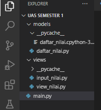
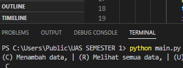

**Repository ini berisi Link modul dalam format pdf, link youtube penjelasan projec dan README.md**
=====================================================================================

  # [Format Dokumen PDF](https://drive.google.com/file/d/1BNSHnlZ9cD32w1_vKinP2h8kJ9KM1NZV/view?usp=share_link)

  # [Format Video Youtube](https://youtu.be/MZkTwTXEKvk)

# -   __NAMA : DONI PERDANA SIRINGORINGO__
# -   __NIM  : 312210687__
# -   __KELAS: TI.22.B1__

MODELS

DAFTAR NILAI

    TAMBAH DATA

-`data = {}` untuk menampung list data yang nanti akan terinput
-deklarasikan fungsi `def tambah_data():`
-`nama = input("Masukan nama: ")` lalu tambahkan input nama, nim, nilai tugas, uts, uas
`nilai_akhir = (nilai_tugas)*30/100 + (nilai_uts)*35/100 + (nilai_uas)*35/100`  untuk nilai akhir diambil dari perhitungan 3 komponen nilai (nilai_tugas: 30%, nilai_uts: 35%, nilai_uas: 35%)
-`data[nama] = [nama, nim, nilai_tugas, nilai_uts, nilai_uas, nilai_akhir]` kita akan masukkan data yang tadi kita input ke dalam `data[nama]'
-lalu cetak `print()`

    UBAH DATA

-deklarasikan fungsi `def ubah_data():`

-`nama = input("Masukan nama untuk mengubah data: ")` kita akan menginput data yang nanti akan di ubah

-`if nama in data.keys(): print("Mau mengubah apa?")` jika 'nama' dari di dalam 'data' maka akan mengembalikan daftar menggunakan fungsi 'keys()' lalu di cetak lah 'print()'

-`sub_data = input("(Semua), (Nama), (NIM), (Tugas), (UTS), (UAS) : ")` membuat menu ubah di dalam sub_data

-`if sub_data.lower() == "semua":` ambil kata kunci 'semua' di dalam `sub_data` jika 'semua' maka input `data[nama][1] = input("Ubah NIM:") data[nama][2] = int(input("Ubah Nilai Tugas: ")) data[nama][3] = int(input("Ubah Nilai UTS: ")) data[nama][4] = int(input("Ubah Nilai UAS: "))`

-`data[nama][5] = data[nama][2] *30/100 + data[nama][3]*35/100 + data[nama][4] *35/100`  kita dapatkan nilai akhir dengan diambil dari perhitungan 3 komponen nilai (tugas: 30%, uts: 35%, uas: 35%).

-lalu cetak `print("\nBerhasil ubah data!")`

-Jika kita ingin mengubah data tertentu maka `elif sub_data.lower() == "nim": data[nama][1] = input("NIM:")` dan berlaku juga untuk nilai tugas, UTS dan UAS

-lalu cetak `print("\nBerhasil ubah data!")`

-`else: print("'{}' tidak ditemukan.".format(nama))` jika kita salah dalam memasukkan nama untuk mengubah data maka akan muncul 'nama tidak di temukan'

    CARI DATA

-deklarasikan fungsi `def cari_data():`
-`nama = input("Masukan nama untuk mencari data: ")` kita akan menginput data yang nanti akan di cari
-`if nama in data.keys():` kita mengambil list 'nama' di dalam 'data' menggunakan pengkondisian
-maka cetak `print("| {0:14} | {1:9} | {2:5} | {3:5} | {4:5} | {5:5}" .format(nama, data[nama][1], data[nama][2], data[nama][3], data[nama][4], data[nama][5]))` untuk menampilkan data yang tersedia
-`else: print("'{}' tidak ditemukan.".format(nama))` jika data yang kita input salah/tidak ditemukan maka akan tercetak 'nama tidak di temukan'

    HAPUS DATA

-deklarasikan fungsi `def hapus_data():`
-`nama = input("Masukan nama untuk menghapus data : ")` kita akan menginput data yang nanti akan di hapus
-`if nama in data.keys():` kita mengambil list 'nama' di dalam 'data' menggunakan pengkondisian
-`del data[nama]` hapus semua 'nama' yang ada di dalam 'data'
-jika sudah maka cetak `print("sub_data '{}' berhasil dihapus.".format(nama))`
-`else: print("'{}' tidak ditemukan.".format(nama))` jika data yang kita input salah/tidak ditemukan maka akan tercetak 'nama tidak di temukan'

VIEW

    INPUT_NILAI

-menambahkan fungsi input yang nanti nya akan di deklarasikan di setiap module nya, `def input_nama():` `def input_nim():` dan yg lainnya, yang nanti akan di masukkan kedalam `data={}`

    VIEW-NILAI

-deklarasikan fungsi `def lihat_data():` Kita menggunakan kondisi percabangan if, ambil data dari `data`
lalu cetak `print()`

Lalu yang terakhir kita eksekusi file main.py

from models import daftar_nilai
from views import input_nilai
from views import view_nilai as nilai

if __name__== '__main__':
    no = 0
    
    while True:
        # opsi mengimput pilihan C, R, U, D, F, Q
        tanya = input( "(C) Menambah data, | (R) Melihat semua data, | (U) Update data, | (D) Menghapus data, | (F) Mencari data | (Q) Keluar program : \n " )
        if tanya in ("c" , "C"):
            # fungsinya untuk perulangan hingga memilih n maka perulangan akan berhernti
            while True:
                no += 1
                # memanggil funsi tambahData dan memparsing data no
                input_nilai.input_data(no)
                print("y or more] Tambah data, n] stop ")
                tambahDatalagi = input("Tambah data lagi ? (y/n) :")
                if tambahDatalagi == 'n' :
                    break
                # jika tanya == R maka lihat semua data
        elif tanya in("r" , "R"):
            # menampilkan data dalam bentuk table menggunkan package tabulate
            nilai.cetak_daftar_nilai()
            # jika tanya D maka edit data
        elif tanya in("u" , "U"):
            daftar_nilai.ubah_data()
            # jika tanya D maka hapus data
        elif tanya in("d" , "D"):
            daftar_nilai.hapus_data()
            # jika tanya F maka cari data
        elif tanya in ("f" , "F"):
            daftar_nilai.cari_data()
        # jika tanya Q maka keluar dari program
        elif tanya in ("q" , "Q"):
            print("")
            print("Anda telah keluar dari program.")
            break

- Berikit langka pertama yang kita lakukan, membuar folder baru dan membuar file didalam nya

- Setelah main.py di jalankan akan muncul pesan seperti ini

- Tambah data

- Melihat data

- Update data

- Menghapus data

- Mencari data

- Keluar dari program

# _Sekian penjelasan dan hasil output, saya ucapkan trimakasi_
